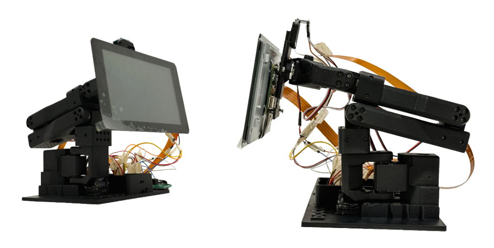
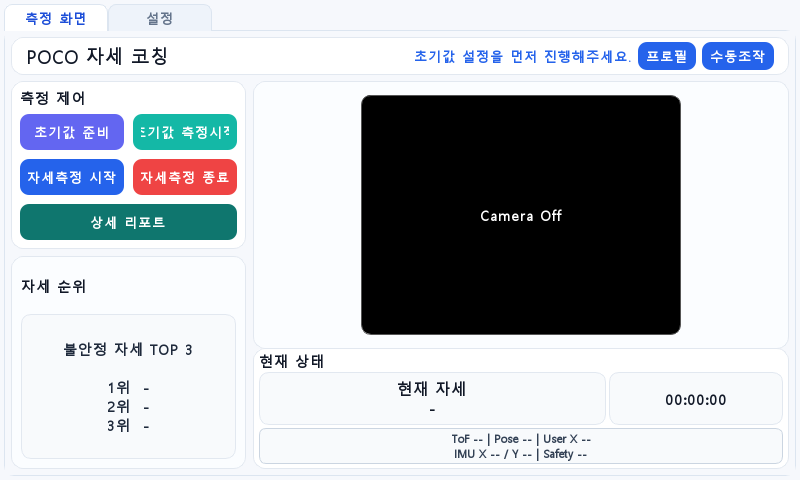
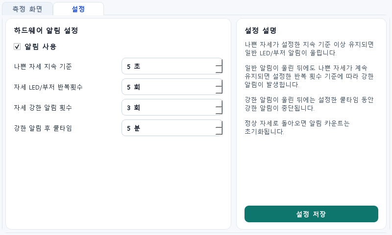
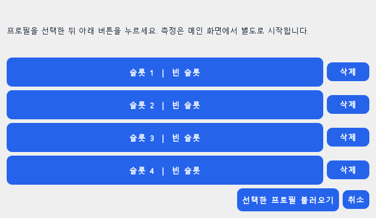
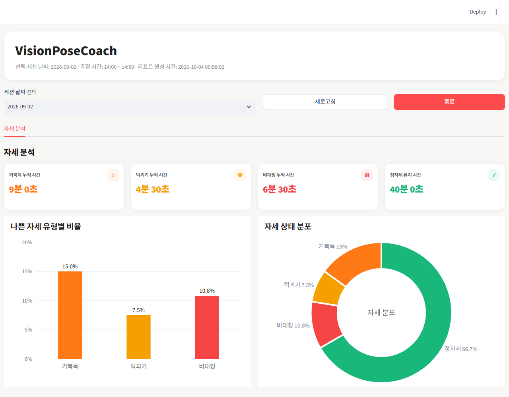
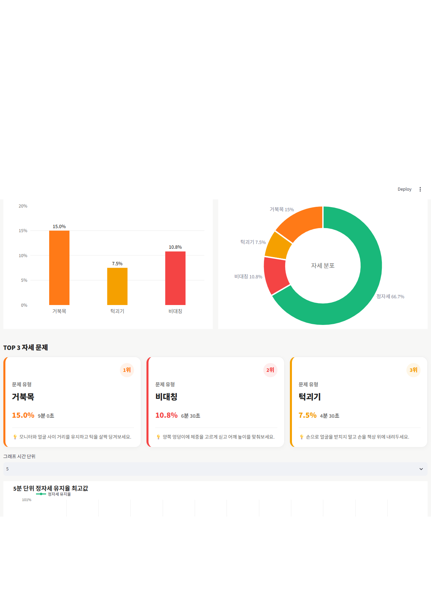
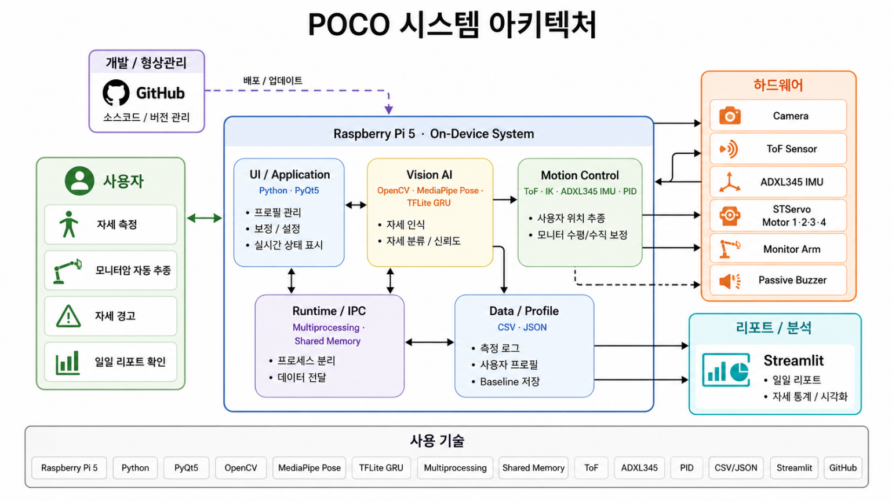
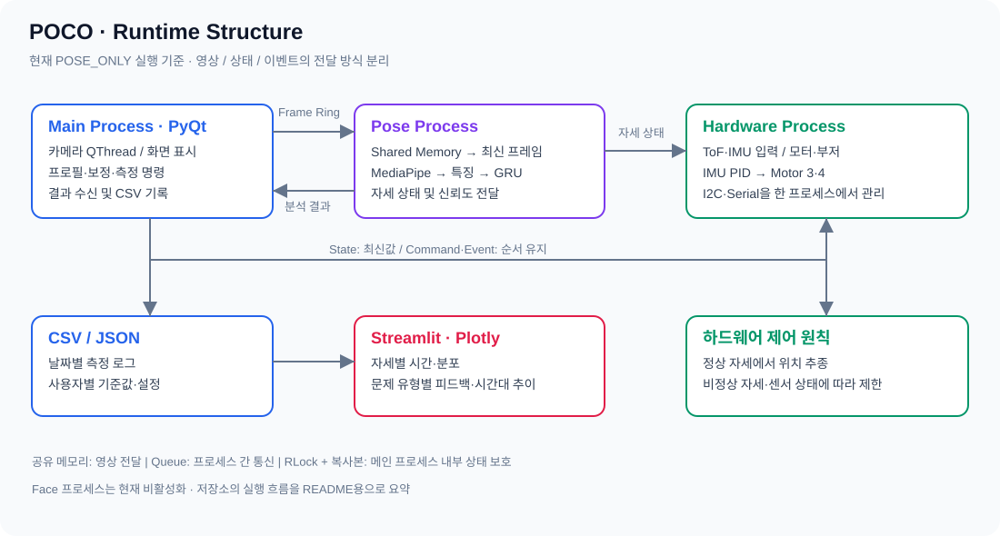
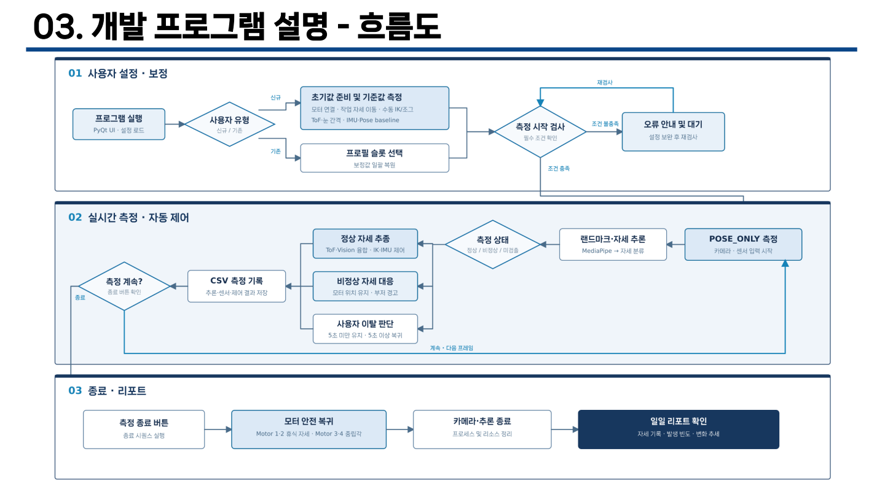
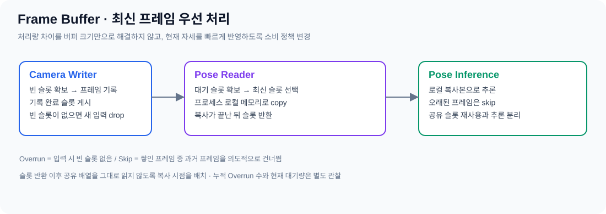

# 🖥️ POCO | AI 기반 자세 코칭 시스템

> 사용자의 자세를 인식하고, 실시간 피드백과 모니터 환경 조절, 일일 리포트로 연결하는 자세 코칭 시스템

## 📌 Overview

POCO는 카메라 영상에서 신체 특징을 추출하고, **사용자별 기준 자세와 GRU 모델을 활용해 정상·비대칭·거북목·턱 괴기 자세를 분류**하는 Raspberry Pi 기반 프로젝트입니다.

판단 결과는 자세 알림과 일일 리포트로 연결됩니다. **V1에서는 비전 기반 자세 코칭을 구현**했고, **V2에서는 정상 자세일 때 모니터 위치를 조절하고 IMU PID 제어로 수평을 유지하는 모니터암까지 확장**했습니다. 잘못된 자세를 그대로 따라가기보다, 자세 판단을 기준으로 환경 조절 여부를 결정합니다.

| 👁️ 자세 인식 | 🔔 코칭·환경 조절 | 📊 기록·분석 |
|---|---|---|
| 카메라 → MediaPipe 특징 추출 → 개인별 기준값 보정 → GRU 분류 | 자세 알림 · 정상 자세에서 모니터 위치 추종 · 수평 유지 | 날짜별 기록 · 자세 분포 · 문제 유형별 피드백 |

🦾 V2 확장 · 4축 모니터암 프로토타입

  

*개발완료보고서에 사용한 실물 사진 · 정면 / 측면*

| 항목 | 내용 |
|---|---|
| Team | 4명 |
| My Role | PyQt UI·Streamlit 리포트, 소프트웨어 구조 설계·코드 통합, 멀티프로세싱, IMU 기반 PID 수평제어, 성능 측정·분석 |
| Platform | Raspberry Pi 5 · 카메라 · 4축 모니터암 |

### 🛠️ Stack

자세 인식 파이프라인은 MediaPipe와 TensorFlow Lite 기반 GRU 모델을 사용합니다.

## 🌱 Project Evolution

| | V1 · Vision Pose Coach | V2 · AI 자세 코칭 모니터암 |
|---|---|---|
| 목표 | 자세 분석·알림·기록을 통한 자세 코칭 | 자세 코칭과 물리적인 모니터 환경 조절 결합 |
| 주요 기능 | 자세·피로도 분석, PyQt 화면, 일일 리포트 | 사용자별 보정, 모니터 위치 추종, IMU PID 수평 유지 |
| 확장 내용 | 비전 분석 결과를 사용자에게 전달 | 비전·UI·하드웨어를 멀티프로세스 구조로 통합 |
| 소스 | [V1 저장소](https://github.com/VisionAITeamProject/VisionPoseCoach) | [현재 저장소](https://github.com/Dongmins11/POCO) |

현재 V2 기본 실행 모드는 `POSE_ONLY`로, 자세 판단과 모니터암 제어를 사용합니다. Face 피로도 분석은 기본 실행에서 비활성화되어 있습니다.

## 🎬 Demo

**[▶ V2 시연 영상 보기](https://youtu.be/UHQtAFz2T6M)** · 썸네일을 클릭하면 YouTube에서 재생됩니다.

## 🖥️ Application Screens

### PyQt · 측정과 제어

**초기값 준비 → 기준값 측정 → 자세 측정 → 리포트 확인**을 한 화면에서 연결했습니다. 사용자 프로필과 수동 조작 화면으로 이동할 수 있고, 자세·측정 시간·센서 상태를 함께 표시합니다.

설정 및 사용자 프로필 화면

설정 화면에서 알림과 제어 관련 항목을 조정하고, 4개 프로필 슬롯으로 사용자별 보정값을 관리합니다.

*저장소의 실제 PyQt 코드를 Windows에서 실행해 캡처했습니다. 카메라·센서·모터를 연결하지 않은 초기 화면입니다.*

### Streamlit · 자세 기록을 읽는 리포트

날짜별 측정 로그를 읽어 **자세별 누적 시간, 정상·비정상 자세 분포, 가장 자주 나타난 문제와 피드백**을 표시합니다. 실시간 측정 화면에서 놓치기 쉬운 하루의 자세 패턴을 다시 확인할 수 있도록 구성했습니다.

문제 유형별 피드백과 시간대별 그래프

*실제 Streamlit 앱에 화면 확인용 예시 CSV를 입력해 캡처했습니다. 이미지의 시간·비율은 실제 실험 결과가 아닙니다.*

## 🏗️ System Architecture

Raspberry Pi 안에서 **UI → 자세 판단 → 모니터암 제어 → 기록·리포트**가 연결됩니다. 다음 구조도는 이 중 직접 설계·통합한 프로세스와 데이터 전달 부분을 요약한 것입니다.

| 데이터 | 전달 방식 | 설계 의도 |
|---|---|---|
| 카메라 영상 | Shared Memory Ring | 영상 데이터를 공유 슬롯으로 전달하고 자세 분석에 최신 프레임 사용 |
| 자세·센서 상태 | 최신값 우선 Queue | 오래된 상태가 UI와 제어에 누적되는 것을 줄임 |
| 보정·측정 명령, 완료·오류 응답 | 순서 유지 Queue | 상태 갱신과 달리 이벤트를 임의로 덮어쓰지 않음 |
| 사용자 기준값·측정 기록 | JSON / CSV | 프로필 복원과 날짜별 리포트 생성 |

📋 준비부터 종료까지의 전체 동작 흐름도

개발완료보고서의 흐름도입니다. 신규 사용자의 보정, 기존 프로필 복원, 자세별 제어, 종료·리포트 흐름을 담았습니다. 현재 코드는 카메라 종료와 앱 전체 종료를 구분해 프로세스 자원을 관리합니다.

## 👨‍💻 My Contribution

| 담당 영역 | 직접 구현한 내용 |
|---|---|
| **PyQt UI** | 사용자 프로필 선택부터 보정·측정·종료까지 이어지는 화면과 실행 흐름 구현 |
| **Streamlit 리포트** | 측정 기록을 바탕으로 자세별 시간·빈도·점수와 피드백을 확인하는 웹 리포트 구현 |
| **구조 설계·코드 통합** | UI, 비전 분석, 센서·모터 제어의 역할과 데이터 전달 흐름을 나누고 하나의 실행 구조로 통합 |
| **멀티프로세싱** | 비전 분석과 하드웨어 제어를 별도 프로세스로 분리하고 Shared Memory·Queue 기반 통신 적용 |
| **모니터 수평제어** | IMU 기준값과 측정값의 차이를 PID로 보정해 Motor 3·4의 기울기 제어 구현 |
| **성능 측정·개선** | 프레임 처리 지연·버퍼 누적을 분석하고 최신 프레임 우선 처리 방식 적용 |

## ⚙️ Key Implementation

### 1. 사용자 흐름과 리포트 연결

신규 사용자는 모니터암 준비와 기준값 보정을 거쳐 측정을 시작하고, 기존 사용자는 저장된 프로필을 다시 적용하도록 구성했습니다. 자세·거리·IMU 기준값과 모터 각도를 묶어 관리하고, 측정 결과는 CSV로 기록해 Streamlit 리포트로 연결했습니다.

**프로필 선택 → 모니터암 준비·사용자 보정 → 실시간 측정·코칭 → 기록 저장 → 일일 리포트**

### 2. UI·비전·하드웨어 처리 분리

카메라 입력은 PyQt 프로세스에서 관리하고, 연산량이 큰 자세 분석과 센서·모터 제어는 별도 프로세스로 분리했습니다. 영상은 Shared Memory로 전달하고, 상태와 명령은 Queue로 주고받도록 구성했습니다.

카메라는 한 곳에서 입력을 관리하고, Hardware Process는 I2C·Serial 장치의 접근을 담당합니다. UI에서는 장치에 직접 접근하는 대신 명령을 보내고, 처리 결과와 최신 상태를 받아 표시합니다.

최신 값이 중요한 상태 정보와 순서를 보장해야 하는 명령·응답을 구분해, 오래된 상태가 쌓이는 문제와 제어 이벤트가 누락되는 문제를 각각 다루었습니다.

### 3. IMU 기반 PID 모니터 수평제어

사용자 보정 시 저장한 IMU 기준값을 바탕으로 기울기 오차를 계산하고, PID 출력으로 Motor 3·4의 목표 각도를 갱신했습니다.

- **Motor 3**: IMU Y축 기반 기울기 보정
- **Motor 4**: IMU X축 기반 기울기 보정
- PID 출력을 각속도로 사용해 제어 주기만큼 목표 각도에 반영
- 최종 목표 각도는 보정된 모터 안전 범위로 제한
- 모터 명령은 공통 MotorService를 통해 전달

모니터의 전후 위치 추종과 수평 유지를 함께 실행할 수 있도록 기존 모니터암 제어 코드와 통합했습니다.

### 4. 통합 과정에서 적용한 데이터·자원 관리

| 설계 항목 | 구현 방식 |
|---|---|
| 공유 프레임 보호 | 슬롯의 프레임을 로컬 메모리로 복사한 뒤 슬롯 반환. 추론은 복사본 사용 |
| PyQt 내부 상태 보호 | `RLock`으로 갱신·읽기 보호, `deepcopy`로 상태 복사본 반환 |
| 상태·이벤트 전달 분리 | 상태는 최신값 Queue, 명령·완료·오류는 순서 유지 Queue 사용 |
| 종료 순서 | 생산자 프로세스 → 결과 수신 스레드 → Queue 정리. 자식 프로세스 종료 후 공유 메모리 해제 |
| 여러 세션의 리포트 집계 | `timestamp` 기준 중복 처리·구간 분리. 1초당 1행을 전제로 기록 수 기반 시간 집계 |

## 🔧 Troubleshooting

### 1. 멀티프로세싱 이후에도 누적되는 프레임 지연

| 단계 | 내용 |
|---|---|
| **문제 발생** | 카메라 입력은 약 **30 FPS**, 자세 분석은 약 **25~29 FPS**로 처리 속도에 차이가 있어 대기 프레임과 판단 지연이 누적되었습니다. |
| **문제 해결 과정** | 버퍼 크기를 늘리는 대신 소비 정책을 변경했습니다. **대기 프레임 확인 → 최신 프레임 선택 → 과거 프레임 건너뜀** 순서로 현재 자세를 우선 처리했습니다. |
| **결과** | 버퍼 포화 이후의 대기 지연이 감소했고, 자세 판단이 현재 입력을 더 빠르게 반영했습니다. 당시 측정 결과는 아래와 같습니다. |

| 지표 | 개선 전 · 버퍼 포화 이후 | 개선 후 |
|---|---:|---:|
| 프레임 처리 지연 | 약 1.3초 | 약 15ms |
| 자세 판단 완료 지연 | 약 1.35초 | 약 50ms |
| 대기 프레임 수 | 대부분 32개 | 약 1~3개 |

*개발완료보고서의 당시 32슬롯 환경 측정값입니다. 현재 코드는 4슬롯이며, 위 수치는 모델 자체의 추론 속도가 아닌 대기 지연 개선 결과입니다.*

Overrun과 Skip을 구분한 이유

| 항목 | 의미 | 확인할 내용 |
|---|---|---|
| Overrun | 빈 슬롯이 없어 새 입력을 버림 | 누적값이 남아 있는지, 현재도 계속 증가하는지 구분 |
| Skip | 최신 프레임 처리를 위해 과거 프레임을 건너뜀 | 실시간성을 위한 의도적 생략 |
| Pending / 지연 | 현재 대기량과 처리까지 걸린 시간 | 프레임이 계속 쌓이고 있는지 함께 확인 |

### 2. 자세 분석이 피로도 분석의 연속 프레임 확보를 방해

| 단계 | 내용 |
|---|---|
| **문제 발생** | 기존에는 자세 분석과 피로도 분석을 하나의 동기적인 흐름에서 처리했습니다. 자세 추론이 길어지면서 피로도 분석에 전달되는 프레임이 줄어들어, 시계열 분석에 필요한 연속 프레임 확보가 어려웠습니다. |
| **문제 해결 과정** | 분석 작업을 별도 프로세스로 분리하고 Shared Memory Ring으로 프레임을 전달하도록 구조를 변경했습니다. 이후 Pose에서 발생한 버퍼 누적은 1번의 최신 프레임 우선 처리로 개선했습니다. |
| **결과** | 분석 작업을 분리할 수 있는 실행 구조를 마련했습니다. 현재는 **Pose와 하드웨어 제어만 활성화**되어 있으며, Face의 연속 프레임 확보와 분석 성능이 최종 검증되었다는 의미는 아닙니다. |

### 3. 사용자·카메라 조건에 따른 정상 자세 오분류 · 팀 공통

| 단계 | 내용 |
|---|---|
| **문제 발생** | 체형·착석 위치·카메라 각도에 따라 특징값이 달라져, 정상 자세인데도 거북목으로 분류되는 사례가 발생했습니다. |
| **문제 해결 과정** | 사용자 정상 자세의 Baseline을 측정하고, **실시간 특징값 − 사용자 Baseline**을 입력에 반영했습니다. 사용자별 보정값을 프로필로 저장·복원하는 흐름과 연결했습니다. |
| **결과** | 개발완료보고서에서 정상 자세의 거북목 오분류 해소와 사용자·카메라 조건의 영향 감소를 확인했습니다. 해당 사례의 개선 결과이며, 모든 사용자에 대한 일반화 성능을 뜻하지 않습니다. |

*1·2번은 멀티프로세싱과 프레임 처리 과정의 발생 사례, 3번은 팀의 AI 오분류 개선 사례입니다. 모델 개발과 개인 담당 범위는 My Contribution에서 구분했습니다.*

## 📂 Code & Documents

| 확인할 내용 | 경로 |
|---|---|
| PyQt 실행·사용자 흐름 | [mainpyQt.py](WorkSpace/pyQt/mainpyQt.py) |
| 프로세스 생성·관리 | [vision_process_manager_profile.py](WorkSpace/pyQt/managers/vision_process_manager_profile.py) |
| 최신 프레임 전달 | [shared_frame_ring.py](WorkSpace/pyQt/ipc/shared_frame_ring.py) |
| 상태·이벤트 Queue | [queue_utils.py](WorkSpace/pyQt/ipc/queue_utils.py) |
| IMU 수평제어 | [motor34_controller.py](WorkSpace/pyQt/services/motor34_controller.py) |
| UI 공유 상태 보호 | [hardware_state_store.py](WorkSpace/pyQt/services/hardware_state_store.py) |
| 프로세스·스레드 종료 순서 | [camera_worker_profile_all.py](WorkSpace/pyQt/camera_worker_profile_all.py) |
| 웹 리포트 | [Streamlit](WorkSpace/streamlit/) |
| 세션별 기록 전처리·집계 | [data_loader.py](WorkSpace/streamlit/preprocess/data_loader.py) · [summary_builder.py](WorkSpace/streamlit/preprocess/summary_builder.py) |
| 설치·실행·하드웨어 설정 | [Setup & Operation](docs/setup-and-operation.md) |

📄 개발 자료와 이전 버전

- [V1 · Vision Pose Coach](https://github.com/VisionAITeamProject/VisionPoseCoach)
- [개발완료보고서](https://drive.google.com/file/d/16OyNF7ngtve8rrRyiLknU3rjZ7oI_OXE/view)
- [V2 시연 영상](https://youtu.be/UHQtAFz2T6M)

